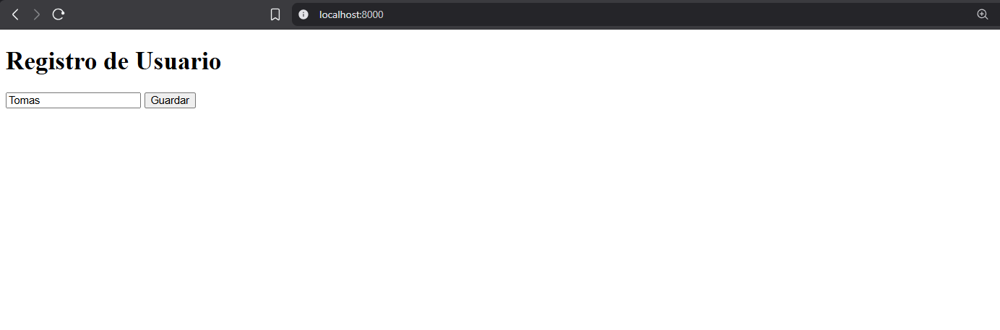
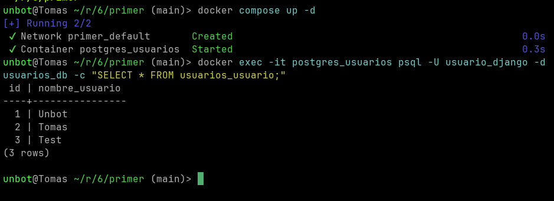

# Arquitectura Software 1 - Registro de Usuarios

Proyecto Django con PostgreSQL para registro de usuarios.

## Requisitos

- Python 3.10+
- Docker
- uv (opcional)

## Instalacion

```bash
# Clonar el repositorio
git clone https://github.com/Unbot2313/arquitectura_software_1
cd arquitectura_software_1
```

### Con uv

```bash
uv sync
```

### Con pip

```bash
python -m venv venv
source venv/bin/activate   # Linux/macOS
venv\Scripts\activate      # Windows
pip install django psycopg2-binary
```

## Ejecutar

```bash
# Levantar PostgreSQL
docker compose up -d
```

### Con uv

```bash
uv run python manage.py migrate
uv run python manage.py runserver
```

### Con pip

```bash
python manage.py migrate
python manage.py runserver
```

## Rutas

- http://127.0.0.1:8000/ - Formulario de registro
- http://127.0.0.1:8000/usuarios/ - Lista de usuarios

## Screenshots

### Formulario de registro


### Base de datos

